# Target Codebase Structure (Diagram + Rules)

Goal: keep Treido behaving the same, but make the repository **obvious**, **bounded**, and **hard to bloat**.

## The structure we want (high level)

```mermaid
flowchart TD
  ROOT["repo root"]

  ROOT --> APP["app/ (Next.js App Router)"]
  ROOT --> COMPONENTS["components/ (shared UI + composites)"]
  ROOT --> HOOKS["hooks/ (shared hooks; keep minimal)"]
  ROOT --> LIB["lib/ (shared domain + server utilities)"]
  ROOT --> I18N["i18n/ (routing + locale utilities)"]
  ROOT --> MESSAGES["messages/ (next-intl dictionaries)"]
  ROOT --> PUBLIC["public/ (static assets)"]
  ROOT --> SUPABASE["supabase/ (migrations, types, policies)"]
  ROOT --> SCRIPTS["scripts/ (dev/ops scripts)"]
  ROOT --> E2E["e2e/ (Playwright specs)"]
  ROOT --> DOCS["docs/ (stable documentation SSOT)"]
  ROOT --> GH[".github/ (CI, templates)"]

  COMPONENTS --> UI["components/ui/ (shadcn primitives only)"]
  COMPONENTS --> COMPOSITES["components/* (composites/layout)"]

  LIB --> DATA["lib/data/ (cached reads, server only)"]
  LIB --> SUPA["lib/supabase/ (clients; server-only SSR)"]
  LIB --> DOMAIN["lib/* (domain modules, types)"]
```

## Root rules (what should NOT be in the repo root)

These are typically **local IDE/tool artifacts** and should be deleted or moved out of the repo:
- IDE folders: `.cursor/`, `.windsurf/`, `.trae/`, `.qoder/`, `.qwen/`, `.kiro/`, etc.
- Agent folders duplicated across tools: `.agent/`, `.agents/` (pick one home, or move under `docs/ai/`)
- Build outputs: `.next/`, `storybook-static/`, `playwright-report/`, `test-results/`, `node_modules/`
- One-off temp audits: `temp-*/`

The audit we’re doing in this `refactor/` folder decides **keep/move/delete** for each of the above with evidence.

## Boundary rules (to prevent code from multiplying)

- `app/**` is route-private by default. Anything shared across routes must live in `components/`, `lib/`, `hooks/`.
- `components/ui/**` is primitives only (Radix + class-variance-authority style). No fetching, no app state, no route imports.
- Prefer **Server Components** for layout/data. Use `"use client"` only on leaf components that need browser APIs.
- `messages/**` is the only place for user-facing copy. Components request copy via `next-intl`.
- `lib/supabase/**` centralizes Supabase clients and query patterns (explicit selects; no `select('*')` on hot paths).

