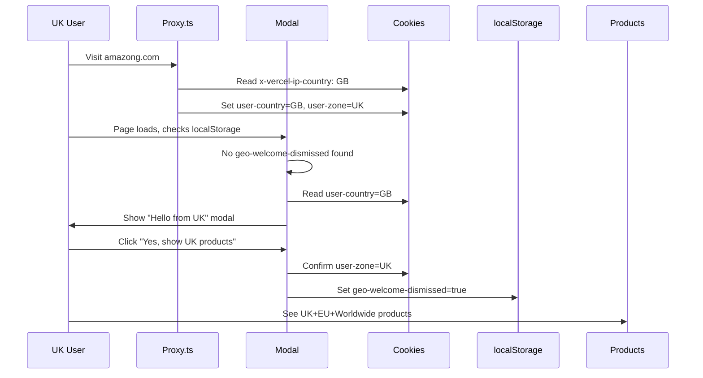
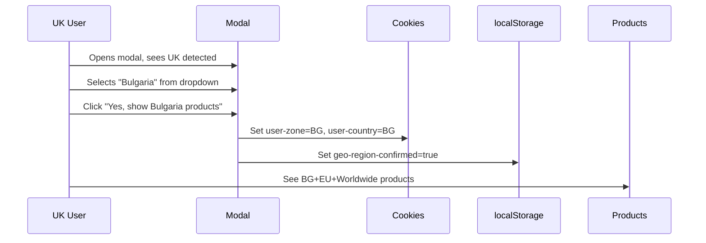
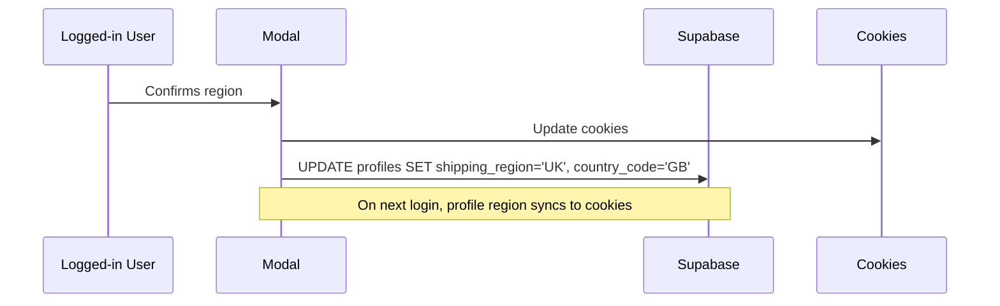

# 🌍 Geo-Location Welcome Modal - Comprehensive Implementation Plan

## Executive Summary

This document outlines a production-ready implementation plan for a geo-location welcome modal that:
1. Detects user's location on first visit
2. Presents a beautiful welcome dialog matching your design system
3. Allows users to select their preferred shopping region
4. Filters products based on shipping availability
5. Optionally stores preferences in Supabase for authenticated users

---

## 📋 Table of Contents

1. [Current System Analysis](#current-system-analysis)
2. [Architecture Decision](#architecture-decision)
3. [Implementation Phases](#implementation-phases)
4. [Database Schema Changes](#database-schema-changes)
5. [Component Specifications](#component-specifications)
6. [Business Logic Flow](#business-logic-flow)
7. [Security Considerations](#security-considerations)
8. [Testing Strategy](#testing-strategy)

---

## 🔍 Current System Analysis

### What Already Exists ✅

| Feature | Status | Location |
|---------|--------|----------|
| **Geo-detection in proxy** | ✅ Working | `proxy.ts` - detects via Vercel/Cloudflare headers |
| **Shipping regions defined** | ✅ Working | `lib/shipping.ts` - BG, UK, EU, US, WW |
| **Country-to-region mapping** | ✅ Working | `lib/shipping.ts` & `lib/geolocation.ts` |
| **Cookies for user preferences** | ✅ Working | `user-country`, `user-zone` cookies |
| **Product shipping filters** | ✅ Working | `ships_to_bulgaria`, `ships_to_uk`, etc. |
| **Supabase profiles table** | ✅ Exists | Basic user data, no location fields |
| **Dialog component** | ✅ Ready | `components/ui/dialog.tsx` - shadcn |
| **Select component** | ✅ Ready | `components/ui/select.tsx` - shadcn |
| **Trust blue CTA tokens** | ✅ Ready | `--color-cta-trust-blue` in globals.css |

### What Needs Building 🔨

| Feature | Priority | Complexity |
|---------|----------|------------|
| Welcome modal component | HIGH | Medium |
| First-visit detection | HIGH | Low |
| User preference persistence | MEDIUM | Medium |
| Profile schema updates | MEDIUM | Low |
| i18n translations | HIGH | Low |
| Shipping region selector | HIGH | Low |

---

## 🏗️ Architecture Decision

### Approach: Client-Side First Visit Detection + Cookie Storage

**Why this approach:**
1. **No Cloudflare Turnstile needed** - We're not preventing bots, just detecting location
2. **Supabase handles auth** - No additional security layer needed for this feature
3. **Cookie-based detection** - Already implemented in proxy.ts
4. **localStorage for first-visit** - Simple, no server round-trip needed

### Data Flow
```
┌─────────────────────────────────────────────────────────────────┐
│                         USER VISITS                              │
└─────────────────────────────────────────────────────────────────┘
                              │
                              ▼
┌─────────────────────────────────────────────────────────────────┐
│  PROXY.TS (Next.js 16)                                          │
│  - Reads IP headers (x-vercel-ip-country, cf-ipcountry)         │
│  - Sets user-country cookie if not exists                       │
│  - Sets user-zone cookie (shipping region)                      │
└─────────────────────────────────────────────────────────────────┘
                              │
                              ▼
┌─────────────────────────────────────────────────────────────────┐
│  CLIENT-SIDE (GeoWelcomeModal)                                  │
│  1. Check localStorage for 'geo-welcome-dismissed'              │
│  2. If not dismissed, check user-country cookie                 │
│  3. Show modal with detected country                            │
│  4. User confirms or changes region                             │
│  5. Update cookies + localStorage                               │
│  6. If logged in, update Supabase profile                       │
└─────────────────────────────────────────────────────────────────┘
                              │
                              ▼
┌─────────────────────────────────────────────────────────────────┐
│  PRODUCT FILTERING                                              │
│  - User with UK zone sees: UK + EU + Worldwide products         │
│  - User with BG zone sees: BG + EU + Worldwide products         │
│  - Filter: ships_to_uk OR ships_to_europe OR ships_to_worldwide │
└─────────────────────────────────────────────────────────────────┘
```

---

## 📅 Implementation Phases

### Phase 1: Core Modal Component (Day 1)
**Duration:** 3-4 hours

- [ ] Create `geo-welcome-modal.tsx` component
- [ ] Use existing shadcn Dialog + Select components
- [ ] Apply trust-blue CTA styling
- [ ] Implement country/region dropdown
- [ ] Add i18n translations (en.json, bg.json)
- [ ] Create custom hook `useGeoWelcome` for state management

**Files to create:**
```
components/geo-welcome-modal.tsx
hooks/use-geo-welcome.ts
```

**Files to modify:**
```
messages/en.json
messages/bg.json
app/[locale]/layout.tsx (or main layout)
```

### Phase 2: First-Visit Detection Logic (Day 1)
**Duration:** 1-2 hours

- [ ] Implement localStorage check for first visit
- [ ] Read cookies for detected country
- [ ] Handle edge cases (no cookies, incognito mode)
- [ ] Add flag for manual region change (vs auto-detected)

**Storage Keys:**
```typescript
// localStorage keys
'geo-welcome-dismissed' // boolean - user has seen modal
'geo-region-confirmed'  // boolean - user explicitly confirmed region
'geo-last-shown'        // timestamp - when modal was last shown

// Cookies (already exist)
'user-country'          // ISO country code (e.g., 'GB', 'BG')
'user-zone'             // Shipping region (e.g., 'UK', 'BG', 'EU')
```

### Phase 3: Supabase Profile Integration (Day 2)
**Duration:** 2-3 hours

- [ ] Create migration for profile columns
- [ ] Update profile on user confirmation
- [ ] Sync profile region on login
- [ ] Handle anonymous → authenticated transition

**New Profile Columns:**
```sql
-- Add to profiles table
shipping_region TEXT DEFAULT NULL, -- BG, UK, EU, US, WW
country_code TEXT DEFAULT NULL,    -- ISO country code
region_auto_detected BOOLEAN DEFAULT TRUE
```

### Phase 4: Product Listing Integration (Day 2)
**Duration:** 2-3 hours

- [ ] Verify existing shipping filter works with new flow
- [ ] Add region indicator in header/UI
- [ ] Allow region change from settings
- [ ] Test all region combinations

### Phase 5: Testing & Polish (Day 3)
**Duration:** 2-3 hours

- [ ] Test on Vercel deployment (real geo headers)
- [ ] Test all shipping region combinations
- [ ] Test authenticated vs anonymous users
- [ ] Accessibility audit (keyboard navigation, screen readers)
- [ ] Mobile responsive testing

---

## 🗃️ Database Schema Changes

### Migration: Add Location Columns to Profiles

```sql
-- Migration: 20251213000000_user_location_preferences.sql

-- Add location preference columns to profiles
ALTER TABLE public.profiles 
ADD COLUMN IF NOT EXISTS shipping_region TEXT DEFAULT NULL 
  CHECK (shipping_region IN ('BG', 'UK', 'EU', 'US', 'WW')),
ADD COLUMN IF NOT EXISTS country_code TEXT DEFAULT NULL,
ADD COLUMN IF NOT EXISTS region_auto_detected BOOLEAN DEFAULT TRUE,
ADD COLUMN IF NOT EXISTS region_updated_at TIMESTAMPTZ DEFAULT NULL;

-- Index for potential region-based queries
CREATE INDEX IF NOT EXISTS idx_profiles_shipping_region 
ON public.profiles(shipping_region) WHERE shipping_region IS NOT NULL;

-- Comment for documentation
COMMENT ON COLUMN public.profiles.shipping_region IS 'User preferred shipping region: BG, UK, EU, US, WW';
COMMENT ON COLUMN public.profiles.country_code IS 'ISO country code detected or selected by user';
COMMENT ON COLUMN public.profiles.region_auto_detected IS 'True if region was auto-detected, false if manually selected';
```

### RLS Policy (Already Covered)
The existing profile policies allow users to update their own profile:
```sql
-- Already exists in schema.sql
"Users can update own profile." on public.profiles for update using (auth.uid() = id)
```

---

## 🧩 Component Specifications

### GeoWelcomeModal Component

```typescript
// components/geo-welcome-modal.tsx

interface GeoWelcomeModalProps {
  locale: string;
  detectedCountry: string;     // ISO code from cookie
  detectedRegion: ShippingRegion; // BG, UK, EU, US, WW
}

// Features:
// - Beautiful shadcn Dialog matching login card design
// - Trust blue CTA button for "Yes, continue"
// - Secondary button for "Change region"
// - Select dropdown with all shipping regions
// - Country flag emoji for visual recognition
// - Smooth animations matching existing UI
```

### Visual Design Specifications

```
┌────────────────────────────────────────────────┐
│                      ✕                          │
│                                                │
│         🇬🇧                                     │
│                                                │
│   Hello! We detected you're                    │
│   visiting from United Kingdom                 │
│                                                │
│   View Amazon UK to see products               │
│   that ship to your location                   │
│                                                │
│   ┌──────────────────────────────────────┐    │
│   │ 🇬🇧 United Kingdom              ▼    │    │
│   └──────────────────────────────────────┘    │
│                                                │
│   ┌──────────────────────────────────────┐    │
│   │      Yes, show UK products           │    │  <- Trust Blue
│   └──────────────────────────────────────┘    │
│                                                │
│   ┌──────────────────────────────────────┐    │
│   │      No, show all products           │    │  <- Secondary
│   └──────────────────────────────────────┘    │
│                                                │
│   You can change this anytime in settings      │
│                                                │
└────────────────────────────────────────────────┘
```

### Styling Tokens Used

```css
/* Primary CTA Button - Trust Blue */
bg-cta-trust-blue hover:bg-cta-trust-blue-hover text-cta-trust-blue-text

/* Card styling */
bg-card border border-border rounded-sm shadow-modal

/* Text */
text-foreground (title)
text-muted-foreground (description)
```

---

## 🔄 Business Logic Flow

### Scenario 1: UK User First Visit (Anonymous)



### Scenario 2: UK User Wants Bulgarian Products



### Scenario 3: Authenticated User



### Product Filtering Logic

```typescript
// When UK user browses products:
// Their user-zone cookie = 'UK'

// Query filters products where:
// ships_to_uk = true OR ships_to_europe = true OR ships_to_worldwide = true

// This means UK users see:
// ✅ Products from UK sellers (ships_to_uk)
// ✅ Products from EU sellers who ship to UK (ships_to_europe)
// ✅ Products that ship worldwide (ships_to_worldwide)
// ❌ Products that ONLY ship to Bulgaria (ships_to_bulgaria only)
// ❌ Products that ONLY ship to USA (ships_to_usa only)
```

---

## 🔒 Security Considerations

### Why Cloudflare Turnstile is NOT Needed

| Concern | Mitigation |
|---------|------------|
| **Bot abuse** | This is a preference modal, not a form submission. No server action to abuse. |
| **Data validation** | Region values are validated against enum before saving |
| **Cookie manipulation** | Cookies can be manipulated, but products still require DB-level shipping availability |
| **Rate limiting** | Profile updates are protected by Supabase RLS - only own profile |

### What IS Protected

1. **Profile updates**: Only authenticated users can update their profile
2. **Cookie security**: `sameSite: 'lax'` prevents CSRF
3. **Region validation**: Only valid ShippingRegion values accepted
4. **Product availability**: DB-level `ships_to_*` flags can't be bypassed

---

## 🧪 Testing Strategy

### Unit Tests

```typescript
// tests/geo-welcome.test.ts
describe('GeoWelcomeModal', () => {
  it('shows modal on first visit')
  it('hides modal after dismissal')
  it('correctly maps country to region')
  it('updates cookies on confirmation')
  it('syncs profile for authenticated users')
})
```

### Integration Tests

```typescript
describe('Geo-based Product Filtering', () => {
  it('UK user sees UK+EU+Worldwide products')
  it('BG user sees BG+EU+Worldwide products')
  it('US user sees US+Worldwide products')
  it('User can change region and see different products')
})
```

### Manual Testing Checklist

- [ ] Test with VPN to different countries
- [ ] Test on Vercel preview (real geo headers)
- [ ] Test anonymous user flow
- [ ] Test authenticated user flow
- [ ] Test modal dismissal persistence
- [ ] Test region change from modal
- [ ] Test mobile responsiveness
- [ ] Test keyboard navigation
- [ ] Test with screen reader
- [ ] Test dark mode styling

---

## 📁 File Structure

```
amazong/
├── components/
│   ├── geo-welcome-modal.tsx        # NEW - Main modal component
│   └── ui/
│       ├── dialog.tsx               # EXISTS - shadcn dialog
│       └── select.tsx               # EXISTS - shadcn select
├── hooks/
│   └── use-geo-welcome.ts           # NEW - State management hook
├── lib/
│   ├── shipping.ts                  # EXISTS - Shipping utilities
│   ├── geolocation.ts               # EXISTS - Country names
│   └── supabase/
│       └── server.ts                # EXISTS - Supabase client
├── supabase/
│   └── migrations/
│       └── 20251213000000_user_location_preferences.sql  # NEW
├── messages/
│   ├── en.json                      # MODIFY - Add translations
│   └── bg.json                      # MODIFY - Add translations
├── app/
│   └── [locale]/
│       ├── layout.tsx               # MODIFY - Add modal
│       └── (main)/
│           └── page.tsx             # May need adjustment
└── proxy.ts                         # EXISTS - Already handles geo
```

---

## 📊 i18n Translations

### English (en.json)

```json
{
  "GeoWelcome": {
    "title": "Hello! We detected you're visiting from {country}",
    "description": "View Amazon {region} to see products that ship to your location",
    "selectRegion": "Select your region",
    "confirmButton": "Yes, show {region} products",
    "declineButton": "No, show all products",
    "changeAnytime": "You can change this anytime in settings",
    "regions": {
      "BG": "Bulgaria",
      "UK": "United Kingdom",
      "EU": "Europe",
      "US": "United States",
      "WW": "Worldwide"
    }
  }
}
```

### Bulgarian (bg.json)

```json
{
  "GeoWelcome": {
    "title": "Здравейте! Установихме, че посещавате от {country}",
    "description": "Разгледайте Amazon {region} за да видите продукти, които доставят до вашата локация",
    "selectRegion": "Изберете вашия регион",
    "confirmButton": "Да, покажи {region} продукти",
    "declineButton": "Не, покажи всички продукти",
    "changeAnytime": "Можете да промените това по всяко време в настройките",
    "regions": {
      "BG": "България",
      "UK": "Великобритания",
      "EU": "Европа",
      "US": "САЩ",
      "WW": "Целия свят"
    }
  }
}
```

---

## ✅ Definition of Done

### Phase 1 Complete When:
- [ ] Modal appears on first visit
- [ ] Modal matches design system (trust blue button, shadcn dialog)
- [ ] User can select region from dropdown
- [ ] Modal is dismissed after action
- [ ] Modal doesn't appear again after dismissal

### Phase 2 Complete When:
- [ ] Cookies are correctly updated
- [ ] localStorage tracks dismissal state
- [ ] Works in incognito mode (graceful fallback)

### Phase 3 Complete When:
- [ ] Database migration applied
- [ ] Profile updates for authenticated users
- [ ] Region syncs on login

### Phase 4 Complete When:
- [ ] Products filter correctly by region
- [ ] UK users see UK+EU+WW products
- [ ] BG users see BG+EU+WW products
- [ ] Region change updates product list

### Phase 5 Complete When:
- [ ] All tests pass
- [ ] Works on mobile
- [ ] Accessible (WCAG 2.1 AA)
- [ ] No console errors
- [ ] Performance acceptable (<100ms modal render)

---

## 🚀 Ready to Implement

**Recommended Start:** Phase 1 - Create the modal component

This is the most visible deliverable and establishes the UI foundation for all subsequent work.

**Command to proceed:**
```
"Let's start Phase 1 - Create the geo-welcome-modal component"
```
