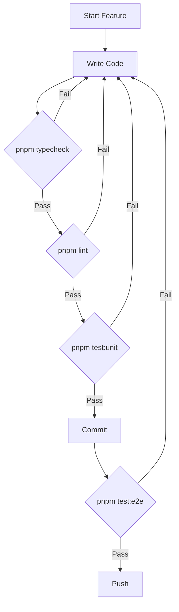

# 🧪 Full Testing Plan - Amazong Marketplace

> **Ultra-Comprehensive Testing Strategy with Agent Automation Prompts**
> 
> Created: December 27, 2025
> 
> This document provides a complete testing plan leveraging existing infrastructure (Vitest, Playwright, axe-core, Lighthouse) with ready-to-use agent prompts for automated test execution and code refactoring.

---

## 📋 Table of Contents

1. [Testing Infrastructure Overview](#testing-infrastructure-overview)
2. [Test Categories & Coverage](#test-categories--coverage)
3. [Agent Automation Prompts](#agent-automation-prompts)
4. [Test Execution Workflow](#test-execution-workflow)
5. [Error Resolution Playbook](#error-resolution-playbook)
6. [Quality Gates & Thresholds](#quality-gates--thresholds)
7. [CI/CD Integration](#cicd-integration)

---

## 🏗️ Testing Infrastructure Overview

### Current Stack

| Tool | Purpose | Config File |
|------|---------|-------------|
| **Vitest** | Unit & Component Tests | `vitest.config.ts` |
| **Playwright** | E2E & Integration Tests | `playwright.config.ts` |
| **axe-core** | Accessibility Testing | `e2e/fixtures/axe-test.ts` |
| **Lighthouse CI** | Performance Audits | `.lighthouserc.js` |
| **TypeScript** | Type Checking | `tsconfig.json` |
| **ESLint** | Code Linting | `eslint.config.mjs` |

### Directory Structure

```
__tests__/              # Unit tests (Vitest)
├── format-price.test.ts
├── product-price.test.tsx
├── safe-json.test.ts
└── url-utils.test.ts

e2e/                    # E2E tests (Playwright)
├── fixtures/
│   ├── test.ts         # Base test fixture with app utilities
│   ├── auth.ts         # Auth utilities
│   ├── authenticated.ts # Authenticated test fixture
│   └── axe-test.ts     # Accessibility test fixture
├── smoke.spec.ts       # Critical route smoke tests
├── full-flow.spec.ts   # Complete user journey tests
├── auth.spec.ts        # Authentication flows
├── orders.spec.ts      # Order management tests
├── profile.spec.ts     # User profile tests
├── reviews.spec.ts     # Review system tests
├── sales.spec.ts       # Seller dashboard tests
└── accessibility.spec.ts # A11y compliance tests

test/
└── setup.ts            # Vitest global setup
```

### Available npm Scripts

```bash
# Linting & Type Checking
pnpm lint               # ESLint static analysis
pnpm typecheck          # TypeScript compilation check

# Unit Tests (Vitest)
pnpm test:unit          # Run all unit tests
pnpm test:unit:watch    # Watch mode for TDD
pnpm test:unit:coverage # Generate coverage report

# E2E Tests (Playwright)
pnpm test:e2e           # Chromium E2E (excludes @accessibility)
pnpm test:e2e:all       # All browsers E2E
pnpm test:e2e:headed    # Chromium E2E with visible browser

# Accessibility Tests
pnpm test:a11y          # axe-core accessibility audit

# Performance Tests
pnpm test:lighthouse    # Lighthouse CI audit (requires build)
pnpm test:lighthouse:local # Local Lighthouse (requires build)

# Production Tests
pnpm test:prod          # Full production test suite
pnpm test:ci            # CI-optimized test run

# Complete Test Suite
pnpm test:all           # lint + typecheck + unit + e2e + a11y
pnpm test:full          # lint + typecheck + unit + prod tests
```

---

## 📊 Test Categories & Coverage

### 1. Static Analysis (Fast Feedback)

**Purpose**: Catch issues before runtime

| Check | Command | Target |
|-------|---------|--------|
| Type Safety | `pnpm typecheck` | All `.ts/.tsx` files |
| Code Quality | `pnpm lint` | All source files |
| Dead Code | `pnpm knip` | Unused exports/deps |

### 2. Unit Tests (Vitest)

**Purpose**: Test isolated business logic

**Current Coverage Areas**:
- `lib/format-price.ts` - Price formatting utilities
- `lib/url-utils.ts` - URL manipulation helpers
- `lib/safe-json.ts` - JSON parsing safety
- Component rendering tests

**Coverage Targets**:
```
lib/**/*.ts       → 80%+ line coverage
components/**/*.tsx → 70%+ line coverage
```

### 3. Integration Tests (Playwright)

**Purpose**: Test component interactions and page behavior

**Test Tags**:
| Tag | Description |
|-----|-------------|
| `@smoke` | Critical path verification |
| `@auth` | Authentication flows |
| `@i18n` | Internationalization |
| `@mobile` | Mobile viewport tests |
| `@perf` | Performance sanity checks |
| `@buyer` | Buyer journey tests |
| `@seller` | Seller journey tests |
| `@security` | Security validation |
| `@a11y` | Accessibility checks |

### 4. E2E User Flows (Playwright)

**Purpose**: Validate complete user journeys

| Flow | File | Critical Routes |
|------|------|-----------------|
| Buyer Journey | `full-flow.spec.ts` | Homepage → Search → Cart → Checkout |
| Seller Journey | `full-flow.spec.ts` | Sell page → Dashboard → Orders |
| Auth Flow | `auth.spec.ts` | Sign up → Login → Password Reset |
| Messaging | `full-flow.spec.ts` | Chat initiation → Conversations |
| Reviews | `reviews.spec.ts` | View → Write → Edit reviews |

### 5. Accessibility Tests (axe-core)

**Purpose**: WCAG 2.1 AA compliance

**Tested Pages**:
- Homepage (all locales)
- Product pages
- Cart & Checkout
- Account pages
- Auth flows

### 6. Performance Tests (Lighthouse)

**Purpose**: Core Web Vitals & UX metrics

**Thresholds**:
```yaml
Performance: >= 70
Accessibility: >= 90
Best Practices: >= 85
SEO: >= 90
```

---

## 🤖 Agent Automation Prompts

### Master Prompt: Full Test Suite Execution & Fix

> **Copy this prompt to start automated testing and refactoring**

```markdown
## Task: Execute Full Test Suite and Fix All Failures

### Phase 1: Static Analysis
Execute these commands sequentially and collect all errors:

1. **TypeScript Check**:
   ```bash
   pnpm typecheck 2>&1 | tee typecheck-output.txt
   ```

2. **ESLint Check**:
   ```bash
   pnpm lint 2>&1 | tee lint-output.txt
   ```

### Phase 2: Unit Tests
Run unit tests with coverage:
```bash
pnpm test:unit:coverage 2>&1 | tee unit-test-output.txt
```

### Phase 3: E2E Tests (with dev server)
Start the dev server first, then run E2E:
```bash
# Terminal 1: Start dev server
pnpm dev

# Terminal 2: Run E2E tests (after server is ready)
cross-env REUSE_EXISTING_SERVER=true BASE_URL=http://localhost:3000 pnpm test:e2e 2>&1 | tee e2e-output.txt
```

### Phase 4: Accessibility Tests
```bash
cross-env REUSE_EXISTING_SERVER=true BASE_URL=http://localhost:3000 pnpm test:a11y 2>&1 | tee a11y-output.txt
```

### Phase 5: Analysis & Fix
After collecting all test outputs:

1. **Parse Results**: Identify all failures from the output files
2. **Categorize**: Group by type (type error, lint error, test failure, a11y violation)
3. **Prioritize**: Fix in order:
   - Type errors (blocking)
   - Lint errors (code quality)
   - Unit test failures (logic bugs)
   - E2E failures (integration issues)
   - A11y violations (compliance)
4. **Fix**: Apply minimal, targeted fixes
5. **Verify**: Re-run failed tests to confirm fixes
6. **Report**: Summarize changes made

### Success Criteria
- ✅ `pnpm typecheck` exits with code 0
- ✅ `pnpm lint` exits with code 0
- ✅ `pnpm test:unit` all tests pass
- ✅ `pnpm test:e2e` smoke tests pass
- ✅ No critical a11y violations
```

---

### Prompt: TypeScript Errors Only

```markdown
## Task: Fix All TypeScript Compilation Errors

1. Run typecheck and capture output:
   ```bash
   pnpm typecheck 2>&1
   ```

2. For each error:
   - Read the file at the specified line
   - Understand the type mismatch
   - Apply the minimal fix (prefer type narrowing over `any`)
   - Verify the fix doesn't break other types

3. Common fixes:
   - Missing null checks → Add optional chaining or null guards
   - Incorrect prop types → Update interface or component props
   - Async/await issues → Add proper Promise types
   - Import errors → Fix path or add missing export

4. Re-run typecheck until clean:
   ```bash
   pnpm typecheck
   ```
```

---

### Prompt: ESLint Errors Only

```markdown
## Task: Fix All ESLint Violations

1. Run lint and capture output:
   ```bash
   pnpm lint 2>&1
   ```

2. Auto-fix what's possible:
   ```bash
   pnpm lint --fix
   ```

3. For remaining manual fixes:
   - `no-unused-vars` → Remove or use the variable
   - `react-hooks/exhaustive-deps` → Add missing deps or document why excluded
   - `@typescript-eslint/*` → Follow TypeScript best practices
   - `import/order` → Organize imports properly

4. Never add `eslint-disable` without justification
```

---

### Prompt: Unit Test Failures

```markdown
## Task: Fix All Unit Test Failures

1. Run unit tests:
   ```bash
   pnpm test:unit 2>&1
   ```

2. For each failure:
   - Read the test file to understand expected behavior
   - Read the implementation file
   - Determine if the bug is in:
     - Test (update expectation)
     - Implementation (fix the code)
   - Apply fix and re-run specific test:
     ```bash
     pnpm test:unit -- <test-file-path>
     ```

3. Common issues:
   - Mock not set up correctly
   - Async timing issues
   - Environment differences (DOM APIs)
   - Changed implementation without test update

4. Ensure coverage doesn't regress
```

---

### Prompt: E2E Test Failures

```markdown
## Task: Fix All E2E/Playwright Test Failures

### Setup
1. Ensure dev server is running:
   ```bash
   pnpm dev
   ```

2. Run E2E tests:
   ```bash
   cross-env REUSE_EXISTING_SERVER=true BASE_URL=http://localhost:3000 pnpm test:e2e 2>&1
   ```

### For Each Failure

1. **Read the test** to understand the user flow being tested
2. **Check the error type**:
   - `TimeoutError` → Element not found or page not loaded
   - `AssertionError` → Element exists but wrong state
   - `Console errors` → Runtime JavaScript errors
   - `Navigation failed` → Route or server issues

3. **Debug strategies**:
   - Run in headed mode: `pnpm test:e2e:headed`
   - Check screenshots in `test-results/`
   - Check video recordings on failure
   - Use `page.pause()` for interactive debugging

4. **Common fixes**:
   - Missing `data-testid` → Add to component
   - Wrong selector → Update to use stable attributes
   - Timing issues → Add proper `waitFor` or `expect.toBeVisible()`
   - Auth state → Ensure proper session handling

5. **Re-run specific test**:
   ```bash
   cross-env REUSE_EXISTING_SERVER=true pnpm -s exec node scripts/run-playwright.mjs test e2e/<file>.spec.ts --project=chromium
   ```
```

---

### Prompt: Accessibility Violations

```markdown
## Task: Fix All Accessibility Violations

1. Run a11y tests:
   ```bash
   cross-env REUSE_EXISTING_SERVER=true BASE_URL=http://localhost:3000 pnpm test:a11y 2>&1
   ```

2. For each violation:
   - Note the rule ID (e.g., `color-contrast`, `button-name`)
   - Find the affected element via selector
   - Apply WCAG-compliant fix

3. Common violations and fixes:
   | Rule | Fix |
   |------|-----|
   | `button-name` | Add `aria-label` or visible text |
   | `color-contrast` | Increase contrast ratio to 4.5:1 |
   | `image-alt` | Add descriptive `alt` text |
   | `link-name` | Add `aria-label` or visible text |
   | `label` | Associate `<label>` with form input |
   | `heading-order` | Ensure h1→h2→h3 hierarchy |
   | `landmark-*` | Add proper ARIA landmarks |

4. Verify with specific test:
   ```bash
   cross-env REUSE_EXISTING_SERVER=true pnpm test:a11y
   ```
```

---

### Prompt: Performance Issues

```markdown
## Task: Fix Performance Issues from Lighthouse

### Prerequisites
Build the production app first:
```bash
pnpm build
```

### Run Lighthouse
```bash
pnpm test:lighthouse:local
```

### Fix Strategies by Metric

**LCP (Largest Contentful Paint)**:
- Optimize hero images (use Next.js Image with priority)
- Reduce server response time
- Preload critical assets

**CLS (Cumulative Layout Shift)**:
- Add explicit width/height to images
- Reserve space for dynamic content
- Avoid inserting content above existing content

**FID/INP (Interaction Latency)**:
- Split large JavaScript bundles
- Defer non-critical scripts
- Use `React.lazy()` for code splitting

**Bundle Size**:
- Analyze with `pnpm analyze`
- Remove unused dependencies
- Dynamic imports for heavy libraries
```

---

### Prompt: Complete Smoke Test + Quick Fix

```markdown
## Task: Run Smoke Tests and Fix Critical Issues

This is a quick health check for the most critical paths.

### Execute
```bash
# Start dev server (if not running)
pnpm dev

# Run smoke tests only
cross-env REUSE_EXISTING_SERVER=true BASE_URL=http://localhost:3000 pnpm -s exec node scripts/run-playwright.mjs test e2e/smoke.spec.ts --project=chromium
```

### Critical Routes Verified
- `/en` - Homepage
- `/bg` - Bulgarian homepage
- `/en/categories` - Category listing
- `/en/search?q=phone` - Search results
- `/en/cart` - Shopping cart
- `/en/account` - Account (auth redirect)
- `/en/sell` - Sell page (auth redirect)

### On Failure
1. Check if the dev server is healthy
2. Review console errors in test output
3. Fix any hydration errors immediately
4. Fix missing landmarks (header, main, footer)
5. Ensure error boundaries aren't triggered
```

---

### Prompt: Production Readiness Check

```markdown
## Task: Full Production Readiness Verification

### Pre-flight Checks
```bash
# 1. Type safety
pnpm typecheck

# 2. Code quality
pnpm lint

# 3. Unit tests
pnpm test:unit
```

### Production Build & Test
```bash
# Build production bundle
pnpm build

# Run production test suite
pnpm test:prod
```

### This Validates:
- ✅ Build compiles without errors
- ✅ E2E tests pass against production build
- ✅ Accessibility audit passes
- ✅ Lighthouse scores meet thresholds
- ✅ No console errors on critical routes
- ✅ Performance within acceptable bounds

### Release Criteria
All of the following must pass:
- [ ] `pnpm typecheck` → 0 errors
- [ ] `pnpm lint` → 0 errors
- [ ] `pnpm test:unit` → 100% pass
- [ ] `pnpm test:prod` → All suites pass
- [ ] No hydration errors
- [ ] No error boundaries triggered
- [ ] Core Web Vitals in green
```

---

## 📈 Test Execution Workflow

### Daily Development Workflow



### Pre-Merge Checklist

```bash
#!/bin/bash
# pre-merge-check.sh

echo "🔍 Running pre-merge checks..."

echo "1/5 TypeScript..."
pnpm typecheck || exit 1

echo "2/5 ESLint..."
pnpm lint || exit 1

echo "3/5 Unit Tests..."
pnpm test:unit || exit 1

echo "4/5 E2E Smoke..."
cross-env REUSE_EXISTING_SERVER=true pnpm -s exec node scripts/run-playwright.mjs test e2e/smoke.spec.ts --project=chromium || exit 1

echo "5/5 Accessibility..."
cross-env REUSE_EXISTING_SERVER=true pnpm test:a11y || exit 1

echo "✅ All checks passed!"
```

---

## 🔧 Error Resolution Playbook

### TypeScript Error Categories

| Error Pattern | Likely Cause | Fix Strategy |
|---------------|--------------|--------------|
| `TS2322` Type not assignable | Prop type mismatch | Update interface or cast safely |
| `TS2339` Property doesn't exist | Missing type definition | Add to interface or use type guard |
| `TS2345` Argument type wrong | Function signature mismatch | Update caller or callee |
| `TS2531` Object possibly null | Missing null check | Add `?.` or `!` (with certainty) |
| `TS7006` Implicit any | Missing type annotation | Add explicit type |

### Playwright Error Categories

| Error Type | Cause | Fix |
|------------|-------|-----|
| `TimeoutError: locator.click` | Element not found | Update selector, add wait |
| `TimeoutError: page.goto` | Server not responding | Check dev server, increase timeout |
| `strict mode violation` | Multiple elements match | Make selector more specific |
| `Console error captured` | Runtime JS error | Fix the application code |
| `Navigation failed` | 404 or 500 response | Fix route or API |

### Common Console Errors to Fix

```typescript
// Hydration errors - ALWAYS FIX
// "Text content does not match server-rendered HTML"
// Solution: Ensure server/client render same content

// Missing key prop
// "Each child in a list should have a unique key"
// Solution: Add key={uniqueId} to mapped elements

// Invalid hook call
// "Hooks can only be called inside function component"
// Solution: Move hook inside component body
```

---

## ✅ Quality Gates & Thresholds

### Mandatory (Blocking)

| Gate | Threshold | Script |
|------|-----------|--------|
| TypeScript | 0 errors | `pnpm typecheck` |
| ESLint | 0 errors | `pnpm lint` |
| Unit Tests | 100% pass | `pnpm test:unit` |
| Smoke Tests | 100% pass | E2E smoke suite |

### Quality Targets (Non-blocking)

| Metric | Target | Current |
|--------|--------|---------|
| Unit Test Coverage | ≥80% | TBD |
| E2E Test Pass Rate | ≥95% | TBD |
| Lighthouse Performance | ≥70 | TBD |
| Lighthouse A11y | ≥90 | TBD |
| Bundle Size (JS) | <500KB | TBD |

### Critical Violations (Immediate Fix)

- ❌ Hydration errors
- ❌ Error boundary triggers on critical routes
- ❌ Auth bypass vulnerabilities
- ❌ Data exposure in page source
- ❌ WCAG A violations

---

## 🚀 CI/CD Integration

### GitHub Actions Workflow

```yaml
# .github/workflows/test.yml
name: Test Suite

on:
  push:
    branches: [main, develop]
  pull_request:
    branches: [main]

jobs:
  static-analysis:
    runs-on: ubuntu-latest
    steps:
      - uses: actions/checkout@v4
      - uses: pnpm/action-setup@v2
      - uses: actions/setup-node@v4
        with:
          node-version: 20
          cache: 'pnpm'
      - run: pnpm install
      - run: pnpm typecheck
      - run: pnpm lint

  unit-tests:
    runs-on: ubuntu-latest
    needs: static-analysis
    steps:
      - uses: actions/checkout@v4
      - uses: pnpm/action-setup@v2
      - uses: actions/setup-node@v4
        with:
          node-version: 20
          cache: 'pnpm'
      - run: pnpm install
      - run: pnpm test:unit:coverage
      - uses: codecov/codecov-action@v3

  e2e-tests:
    runs-on: ubuntu-latest
    needs: static-analysis
    steps:
      - uses: actions/checkout@v4
      - uses: pnpm/action-setup@v2
      - uses: actions/setup-node@v4
        with:
          node-version: 20
          cache: 'pnpm'
      - run: pnpm install
      - run: pnpm exec playwright install --with-deps
      - run: pnpm test:e2e:all
      - uses: actions/upload-artifact@v4
        if: failure()
        with:
          name: playwright-report
          path: playwright-report/

  lighthouse:
    runs-on: ubuntu-latest
    needs: [unit-tests, e2e-tests]
    steps:
      - uses: actions/checkout@v4
      - uses: pnpm/action-setup@v2
      - uses: actions/setup-node@v4
        with:
          node-version: 20
          cache: 'pnpm'
      - run: pnpm install
      - run: pnpm build
      - run: pnpm test:lighthouse
```

---

## 📚 Quick Reference

### Run Everything (Sequential)

```bash
pnpm test:all
```

### Run Specific Test File

```bash
# Unit test
pnpm test:unit -- __tests__/format-price.test.ts

# E2E test
pnpm -s exec node scripts/run-playwright.mjs test e2e/smoke.spec.ts --project=chromium
```

### Run Tests by Tag

```bash
# Only smoke tests
pnpm -s exec node scripts/run-playwright.mjs test --grep @smoke

# Only mobile tests
pnpm -s exec node scripts/run-playwright.mjs test --grep @mobile

# Exclude accessibility
pnpm -s exec node scripts/run-playwright.mjs test --grep-invert @accessibility
```

### Debug E2E Test

```bash
# Headed mode (see browser)
pnpm test:e2e:headed

# Debug mode (step through)
pnpm -s exec node scripts/run-playwright.mjs test --debug

# Specific test with UI
pnpm -s exec node scripts/run-playwright.mjs test e2e/smoke.spec.ts --ui
```

### View Test Reports

```bash
# Playwright HTML report
pnpm -s exec playwright show-report playwright-report

# Coverage report
open coverage/index.html
```

---

## 🎯 Summary: One-Command Full Test

For a complete test run with automatic server management:

```bash
# Full production readiness check
pnpm test:full
```

This runs:
1. ✅ ESLint
2. ✅ TypeScript
3. ✅ Unit Tests
4. ✅ Production Build
5. ✅ E2E Tests (against prod build)
6. ✅ Accessibility Tests
7. ✅ Lighthouse Audit

---

**Document maintained by**: AI Agent
**Last updated**: December 27, 2025
**Next review**: When test infrastructure changes
