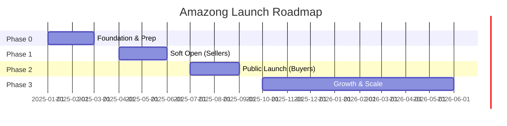

# 🚀 AMAZONG: Launch Roadmap
> **Version:** 1.0  
> **Timeline:** 18 Months (Q1 2025 - Q2 2026)  
> **Goal:** €2.5M GMV, 25k MAU, 500 Verified Sellers

---

## Overview Timeline

---

## Phase 0: Foundation (Months 1-3)
**Jan 2025 - Mar 2025**

### Objective
Complete product development, establish operational infrastructure, and prepare for seller onboarding.

### Milestones

| Week | Milestone | Owner | Status |
|:-----|:----------|:------|:-------|
| 1-4 | MVP Feature Freeze | Dev Team | ☐ |
| 1-4 | Stripe Connect Integration (Payments) | Dev Team | ☐ |
| 1-4 | Legal: Terms of Service, Privacy Policy, Seller Agreement | Legal/Founder | ☐ |
| 5-8 | QA & Load Testing | Dev Team | ☐ |
| 5-8 | Charity Partner MOU Signed (Animal Rescue Sofia) | Founder | ☐ |
| 5-8 | Sales Playbook Created (Local Hero Outreach) | Marketing | ☐ |
| 9-12 | Landing Page Live (waitlist sign-up) | Marketing | ☐ |
| 9-12 | Internal Beta (Team + Friends & Family) | All | ☐ |
| 9-12 | "Nano Banana" Brand Assets Created (Logo, Voice, Templates) | Marketing | ☐ |

### Deliverables
*   ✅ Fully functional MVP
*   ✅ Signed charity partnership
*   ✅ 50+ waitlist sign-ups (sellers)
*   ✅ Brand identity kit

### Budget (Phase 0)

| Category | Amount |
|:---------|:-------|
| Development (Final Sprint) | €5,000 |
| Legal & Compliance | €2,000 |
| Branding & Design | €1,500 |
| Hosting/Infra (3 mo) | €300 |
| **TOTAL** | **€8,800** |

---

## Phase 1: Soft Open (Months 4-6)
**Apr 2025 - Jun 2025**

### Objective
Onboard first 200 verified sellers, build initial inventory, validate seller experience.

### Key Activities

| Activity | Description | Target |
|:---------|:------------|:-------|
| **Direct Seller Outreach** | Cold email/call top-rated local businesses from Google Maps | 500 contacts |
| **"0% Commission" Campaign** | First 100 sellers get 0% commission for 6 months | 100 sign-ups |
| **Facebook Group Engagement** | Post in "Bulgarian Entrepreneurs" groups | 50 organic leads |
| **Seller Onboarding Support** | White-glove onboarding for first sellers | 100% activation |
| **Content Creation Begins** | Stockpile 30+ "Nano Banana" videos for Phase 2 | 30 videos |

### Milestones

| Week | Milestone | Target |
|:-----|:----------|:-------|
| 1-4 | First 50 Sellers Onboarded | 50 |
| 1-4 | 1,000 Products Listed | 1,000 |
| 5-8 | First 100 Sellers, First Transactions | 100 sellers, 50 orders |
| 9-12 | 200 Sellers, 5,000 Products | 200 sellers |

### Success Criteria
*   ✅ 200 verified sellers
*   ✅ 5,000 SKUs across 5+ categories
*   ✅ <5% seller churn
*   ✅ First €10,000 GMV

### Budget (Phase 1)

| Category | Amount |
|:---------|:-------|
| Seller Acquisition (1 FTE Sales) | €4,500 |
| Facebook Ads (Seller Targeting) | €1,500 |
| Content Production (AI Tools + Designer) | €1,000 |
| Hosting/Infra (3 mo) | €300 |
| **TOTAL** | **€7,300** |

---

## Phase 2: Public Launch (Months 7-9)
**Jul 2025 - Sep 2025**

### Objective
Acquire first 10,000 buyers through "Nano Banana" viral content and "Paws & Profits" charity campaign.

### Key Activities

| Activity | Description | Target |
|:---------|:------------|:-------|
| **"Nano Banana" Content Blitz** | 3x TikTok, 2x Reels, 1x Shorts daily | 5M impressions |
| **"Paws & Profits" Campaign Launch** | PR, Influencer partnerships, Charity event | 100K reach |
| **Influencer Seeding** | Send products to 20 micro-influencers | 20 posts |
| **Paid Social Ads** | Retargeting website visitors, lookalike audiences | €2,000/mo |
| **PR Push** | Press releases to Bulgarian tech/business media | 5 articles |

### Launch Week (Week 1)

| Day | Activity |
|:----|:---------|
| Mon | "Nano Banana" Teaser Video (TikTok/Reels) |
| Tue | Press Release to Media |
| Wed | Influencer Unboxing Videos Go Live |
| Thu | "Paws & Profits" Charity Event (Shelter Visit Livestream) |
| Fri | 48-Hour Flash Sale (10% off sitewide) |
| Sat-Sun | User-Generated Content Contest (#NanoBanana) |

### Milestones

| Week | Milestone | Target |
|:-----|:----------|:-------|
| 1-4 | 5,000 MAU, 500 Orders | 5k MAU |
| 5-8 | 10,000 MAU, 2,000 Orders | 10k MAU |
| 9-12 | 15,000 MAU, €300k Cumulative GMV | 15k MAU |

### Success Criteria
*   ✅ 15,000 MAU
*   ✅ €300,000 GMV (cumulative)
*   ✅ 30% repeat purchase rate
*   ✅ CAC < €15

### Budget (Phase 2)

| Category | Amount |
|:---------|:-------|
| Paid Social (FB, IG, TikTok) | €6,000 |
| Influencer Payments | €4,500 |
| PR & Events | €1,500 |
| Content Production | €1,500 |
| Charity Donation (Paws & Profits) | €1,000 |
| Hosting/Infra (3 mo) | €600 |
| **TOTAL** | **€15,100** |

---

## Phase 3: Growth & Scale (Months 10-18)
**Oct 2025 - Jun 2026**

### Objective
Reach €2.5M GMV run-rate, 25k MAU, and begin preparing for Series A.

### Key Activities

| Activity | Description | Target |
|:---------|:------------|:-------|
| **Expand Karma Commerce** | Add "Closet to Cause" (Fashion) and "Tech for Tots" (Electronics) | 3 campaigns |
| **Mobile App Launch (iOS + Android)** | Native apps for better retention | 10k downloads |
| **Seller Analytics Dashboard** | Advanced tools for Premium/Business sellers | Feature launch |
| **Geographic Expansion Research** | Evaluate Serbia, North Macedonia, Greece | Feasibility study |
| **Series A Prep** | Data room, pitch deck refinement, investor outreach | Investor meetings |

### Quarterly Milestones

| Quarter | GMV Target | MAU Target | Sellers |
|:--------|:-----------|:-----------|:--------|
| Q4 2025 | €500,000 | 18,000 | 350 |
| Q1 2026 | €1,200,000 | 22,000 | 450 |
| Q2 2026 | €2,500,000 | 25,000 | 500 |

### Success Criteria
*   ✅ €2.5M GMV (run-rate)
*   ✅ 25,000 MAU
*   ✅ 500 verified sellers
*   ✅ CAC < €12
*   ✅ Series A term sheet

### Budget (Phase 3 - 9 months)

| Category | Amount |
|:---------|:-------|
| Marketing (Total) | €45,000 |
| Mobile App Development | €20,000 |
| Additional Hires (2 FTE) | €36,000 |
| Infrastructure Scaling | €5,000 |
| Legal (Series A Prep) | €5,000 |
| **TOTAL** | **€111,000** |

---

## Total Launch Budget Summary

| Phase | Duration | Budget |
|:------|:---------|:-------|
| Phase 0: Foundation | 3 months | €8,800 |
| Phase 1: Soft Open | 3 months | €7,300 |
| Phase 2: Public Launch | 3 months | €15,100 |
| Phase 3: Growth | 9 months | €111,000 |
| **GRAND TOTAL** | **18 months** | **€142,200** |

---

## Key Dependencies & Risks

| Dependency | Risk Level | Mitigation |
|:-----------|:-----------|:-----------|
| Stripe Approval for Bulgaria | Low | Early application, backup (ePay.bg) |
| Charity Partner Commitment | Medium | Signed MOU, backup partners identified |
| Content Virality Uncertainty | Medium | Supplement organic with paid; A/B testing |
| Developer Availability | Medium | Freelance bench identified; modular architecture |

---

**Document Owner:** [Founder Name]  
**Last Updated:** December 2024
