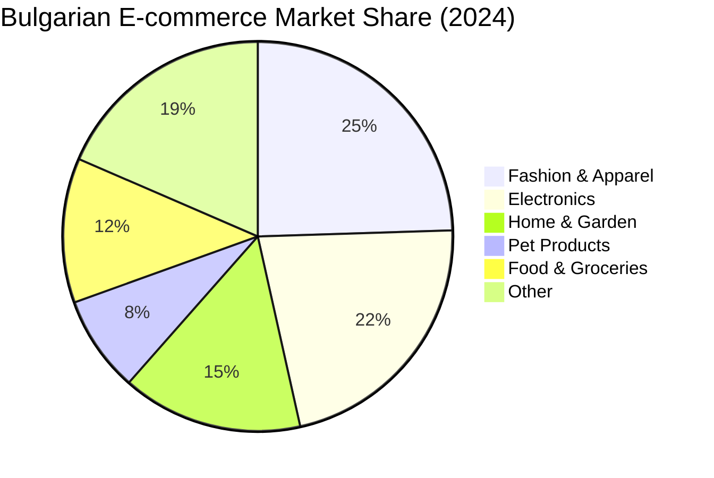

# 📈 AMAZONG: Strategic Marketing Plan
> **Version:** 2.0 (Investor Edition)  
> **Period:** FY 2025-2026  
> **Market:** Bulgaria  
> **Goal:** Capture 3-5% of Bulgarian E-commerce Market by Q4 2026

---

## 1. Market Analysis

### 1.1 Market Size & Growth

| Metric | 2024 Value | Growth Rate | Source |
|:-------|:-----------|:------------|:-------|
| **Bulgaria E-commerce TAM** | €2.34 Billion | 15-20% YoY | Bulgarian E-commerce Association |
| **Online Share of Retail** | 5-10% | Growing | ECDB |
| **Projected 2027 TAM** | €3.1 Billion | — | Ecommerce News EU |

### 1.2 Market Segmentation



**Strategic Focus:** Fashion (our "Closet to Cause" campaign), Pet Products (our "Paws & Profits" campaign), Home & Garden (high-margin, local manufacturing potential).

### 1.3 Consumer Behavior
*   **Mobile Dominance:** 56% of e-commerce transactions on smartphones.
*   **Payment Preferences:** Digital wallets (41.2%), followed by card payments.
*   **Trust Factors:** Verified sellers, reviews, secure payment logos are key decision drivers.

---

## 2. Competitive Landscape

### 2.1 Key Competitors

| Competitor | Type | Strengths | Weaknesses | 2024 Revenue/Metrics |
|:-----------|:-----|:----------|:-----------|:---------------------|
| **eMag.bg** | Marketplace (B2C) | #1 brand trust, excellent logistics, 60%+ of marketplace products from 3rd party sellers | High fees (15%+), impersonal, corporate feel | $270M revenue |
| **OLX.bg** | Classifieds (C2C) | Massive traffic (2.8M users), free listings, strong brand for used goods | No payment integration, high fraud perception, "flea market" feel | N/A (Ad-driven) |
| **Bazar.bg** | Classifieds (C2C) | Multi-category listings | Outdated UX, lower trust than OLX | N/A |
| **Temu/Shein** | Direct (D2C) | Ultra-low prices, trendy products | Quality issues, slow shipping (2+ weeks), no local presence | Growing rapidly |

### 2.2 SWOT Analysis

| | **Helpful** | **Harmful** |
|:--|:------------|:------------|
| **Internal** | **Strengths:** Lower fees than eMag, Trust features (escrow, verified sellers), Unique differentiators (Karma Commerce, Nano Banana AI) | **Weaknesses:** No brand recognition, Limited initial inventory, No logistics infrastructure |
| **External** | **Opportunities:** Gap between "corporate" eMag and "chaotic" OLX, Growing eco-conscious consumer base, Underserved small business segment | **Threats:** eMag could lower fees, OLX could add payments, Temu price competition |

### 2.3 Competitive Positioning

> **Amazong = The "Third Way"**
> Not as sterile as eMag. Not as risky as OLX. The trusted community marketplace.

**Differentiation Strategy:**
1.  **For Sellers:** Lower fees (5-10% vs. 15%+), simple onboarding, verified store badges.
2.  **For Buyers:** Secure payments, verified sellers, "feel good" charity commerce.
3.  **For Brand:** "Nano Banana" AI-driven content creates an entertaining, distinctive voice.

---

## 3. Strategic Pillars

### Pillar 1: "Local Hero" Acquisition (Supply-Side)

**Objective:** Onboard 500 verified local businesses in first 6 months.

| Tactic | Description | Budget |
|:-------|:------------|:-------|
| **0% Commission Launch** | First 100 businesses get 0% commission for 6 months | €0 (foregone revenue) |
| **Direct Outreach** | Sales team contacts top-rated local shops (Google Maps scraping) | €3,000/mo (1 FTE) |
| **Facebook Business Groups** | Organic posts + paid ads targeting "Bulgarian Entrepreneurs" groups | €500/mo |
| **Partnership with Industry Associations** | Bulgarian E-commerce Association, Small Business Bulgaria | €0 (PR value) |

**KPIs:** 500 verified sellers, 10,000 SKUs listed.

---

### Pillar 2: "Karma Commerce" (Brand Equity)

**Objective:** Build emotional loyalty that cannot be copied.

| Campaign | Charity Partner | Category | Mechanic |
|:---------|:----------------|:---------|:---------|
| **"Paws & Profits"** | Animal Rescue Sofia | Pet Products | "Buy 1 bag of food, we donate 1 meal" |
| **"Closet to Cause"** | Winter Coats for Kids Foundation | Fashion (Used) | "50% of profits from used clothing go to charity" |
| **"Tech for Tots"** | SOS Children's Villages Bulgaria | Electronics (Used) | "Donate your old device or buy refurbished to support children" |

**Marketing Assets:**
*   AI-generated video showing the **impact chain** ("This dog food fed Max at Shelter Sofia")
*   Real-time "Impact Counter" on homepage ("12,345 meals donated this month")
*   "Patron" badge for buyers who purchase charity-linked items

**KPIs:** 10% of GMV from Karma Commerce items, 50,000 social media impressions on impact stories.

---

### Pillar 3: "Nano Banana" Viral Engine (Demand Gen)

**Objective:** Lower Customer Acquisition Cost (CAC) by 40% via organic virality.

**The "Nano Banana" Concept:**
*   A quirky, slightly "glitchy" AI mascot that serves as the brand voice.
*   Content is **Entertainment First, Ads Second.**
*   Mix of absurdist humor + genuine product value.

**Content Workflow:**

```mermaid
flowchart LR
    A[Trend Research\n"What's viral today?"] --> B[AI Prompt\n"Nano Banana Script"]
    B --> C[Visual Gen\nMidjourney/Veo]
    C --> D[VO/Edit\nElevenLabs + CapCut]
    D --> E[Post\nTikTok/Reels/Shorts]
    E --> F[Analyze\nPostHog]
    F --> A
```

**Content Types:**
1.  **Surrealist Product Demos:** "A cat flying a drone. The drone is €50 on Amazong."
2.  **Price Roasts:** "This costs €100 on *The Other Guys*. It's €60 here. Don't be a lemon."
3.  **Impact Stories (Karma Commerce):** AI-narrated stories of shelter animals fed by purchases.

**Channel Strategy:**

| Channel | Content Frequency | Objective | Budget |
|:--------|:------------------|:----------|:-------|
| **TikTok** | 3x/day | Awareness, Virality | €0 (Organic) |
| **Instagram Reels** | 2x/day | Awareness, Traffic | €0 (Organic) |
| **YouTube Shorts** | 1x/day | SEO, Longevity | €0 (Organic) |
| **Facebook Groups** | 5x/week | Trust, Community | €500/mo (Paid Boost) |

**KPIs:** 1M organic impressions/mo, CAC < €15.

---

## 4. Influencer & Partnership Strategy

### 4.1 Influencer Tiers

| Tier | Follower Range | Approach | Compensation |
|:-----|:---------------|:---------|:-------------|
| **Micro** | 5k-20k | Gift products + affiliate code | Free products + 10% commission |
| **Mid** | 20k-100k | Paid collaboration + affiliate | €100-€300/post + 5% commission |
| **Macro** | 100k+ | Long-term ambassador deal | €500-€1,000/mo + equity consideration |

### 4.2 Target Influencer Categories
*   **Fashion/Lifestyle:** "Closet Cleanout" content
*   **Pet Owners:** "Paws & Profits" unboxing, shelter visits
*   **Tech Reviewers:** Refurbished electronics reviews
*   **Mom Bloggers:** Kids' clothing, toys, home goods

### 4.3 Strategic Partnerships

| Partner Type | Example | Value Exchange |
|:-------------|:--------|:---------------|
| **Charity Partners** | Animal Rescue Sofia | We donate, they promote to their audience |
| **Industry Associations** | Bulgarian E-commerce Assoc. | Credibility, event access, PR |
| **Local Manufacturers** | Bulgarian Craft Guilds | Exclusive "Made in Bulgaria" section |
| **Logistics Partners** | Econt, Speedy | Discounted shipping rates in exchange for volume |

---

## 5. Channel Budget Allocation (Year 1)

| Channel | Monthly Budget | Annual Budget | % of Total |
|:--------|:---------------|:--------------|:-----------|
| **Organic Social (Content Prod.)** | €1,000 | €12,000 | 15% |
| **Paid Social (FB/IG Ads)** | €2,000 | €24,000 | 30% |
| **Influencer Marketing** | €1,500 | €18,000 | 22.5% |
| **PR & Events** | €500 | €6,000 | 7.5% |
| **Seller Acquisition (Sales Team)** | €1,500 | €18,000 | 22.5% |
| **Contingency** | €200 | €2,400 | 2.5% |
| **TOTAL** | **€6,700** | **€80,400** | **100%** |

---

## 6. Key Performance Indicators (KPIs)

| Metric | Q1 Target | Q2 Target | Year 1 Target |
|:-------|:----------|:----------|:--------------|
| **Sellers Onboarded** | 200 | 400 | 500 |
| **SKUs Listed** | 5,000 | 15,000 | 30,000 |
| **MAU (Buyers)** | 5,000 | 15,000 | 25,000 |
| **GMV** | €100,000 | €500,000 | €2,500,000 |
| **CAC** | €20 | €15 | €12 |
| **Organic Impressions** | 500,000 | 2,000,000 | 10,000,000 |
| **Karma Commerce GMV %** | 5% | 8% | 10% |

---

## 7. Risk Mitigation

| Risk | Likelihood | Mitigation Strategy |
|:-----|:-----------|:--------------------|
| **Low Seller Adoption** | Medium | Extended 0% commission period, direct sales outreach |
| **Poor Organic Reach** | Medium | Supplement with targeted paid ads, A/B test content formats |
| **Charity Partner Issues** | Low | Vet partners thoroughly, have backup partners |
| **Negative PR (Scams)** | Low | Strict seller verification, proactive customer service, rapid response team |

---

**Document Owner:** [Founder Name]  
**Next Review:** March 2025
